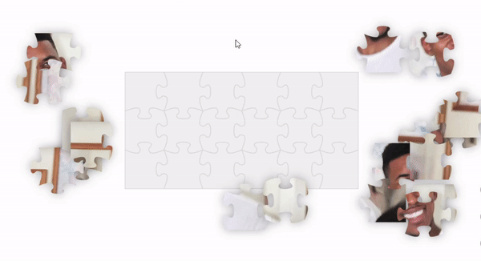

# Puzzlefy

Generate a puzzle from any image. Made with [p5.js](https://p5js.org/).

## 🕹️ [Play in browser](https://puzzlefy.stephcraft.net)

### Make your own puzzle
`https://puzzlefy.netlify.app/?image=<url>&cols=<number>&rows=<number>`
- **image**: link to an image url `.jpg`, `.png`... and also certain `.gif`s!
- **cols**: width of puzzle in pieces
- **rows**: height of puzzle in pieces

> If the **cols** and **rows** parameters are not specified, the aspect ratio of the image will be used instead

### Example
- [Obama prism](https://puzzlefy.netlify.app/?image=https://c.tenor.com/1g50P-G_JicAAAAC/obama-triangle.gif&cols=4&rows=4)

<!--
| [Website](https://puzzlefy.netlify.app) |  [X/Twitter](https://twitter.com/Puzzle_fy)|
|---|---|
-->

## ⌨️ Edit the code

### Feature ideas
* `.gif` cors origin fix ― [**Issue**](https://github.com/Stephcraft/Puzzlefy/issues/1)
* `.gif` load time improvement ― [**Issue**](https://github.com/Stephcraft/Puzzlefy/issues/3)
* Dynamic loading screen ― [**Issue**](https://github.com/Stephcraft/Puzzlefy/issues/2)
* Draw placed pieces in separate graphics for performance ― [**Issue**](https://github.com/Stephcraft/Puzzlefy/issues/4)
* Random image if `image=` url parameter is not set ― [**Issue**](https://github.com/Stephcraft/Puzzlefy/issues/5)
* Auto solve functionality ― [**Issue**](https://github.com/Stephcraft/Puzzlefy/issues/6)
* Reset functionality ― [**Issue**](https://github.com/Stephcraft/Puzzlefy/issues/7)
* Large puzzles do not fully utilize the screen space ― [**Issue**](https://github.com/Stephcraft/Puzzlefy/issues/8)
* Puzzles with the same exact visuals can be interchanged (usually solid colors) ― [**Issue**](https://github.com/Stephcraft/Puzzlefy/issues/9)
* Background clip area vs free pieces clip setting
* Customize puzzle pattern (jigsaw shapes and in/out directions)
* Customize settings (feedback when invalid placed, allow preview, ...)
* Zoom and moving around camera controls. Useful for large puzzles and mobile devices (pinch to zoom)
